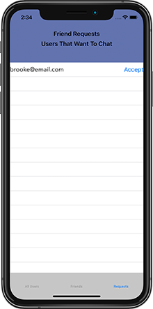
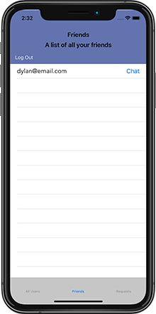

# Chat
    

Description:

This application was created to develop a private person to person chat application. Chat uses Firebase and MessageKit to create this application. Once users log in chat displays a list of all users that are signed up for the Chat Application. You can send friend requests to any users that you know, once the other user accepts your friend requests then you are able to have direct one to one discussions with that user. 

The Chat Application utilizes the following:

Firebase
MessageKit
Tab Bar Controller

-When first logging in the user will need to enter an email address and password. This is saved in Firebase and the user will need to keep this userID/Password in order to log into the application. 

-After creating a userID/Password the user is added to the ‘All Users’ list. The user can now select that tab and choose a user to add to their friends list.

-Once the user sends a friend request to another person and they have accepted, they can then chat with that user using a chat view controller set up using MessageKit. 

