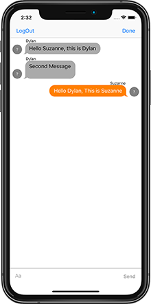

# Chat
    

Description:

This application was created to develop a private person to person chat application. Chat uses Firebase and MessageKit to create this application. Once the user creates a username/password they are added to the 'All Users' screen along with everyone else that is logged into Chat. You can send a friend request to users that you know. Once the friend accepts the request, you are enabled to start a chat with that person. 

Technologies Used:

-UICollectionView

-UITabBarController

-Firebase

-MessageKit

